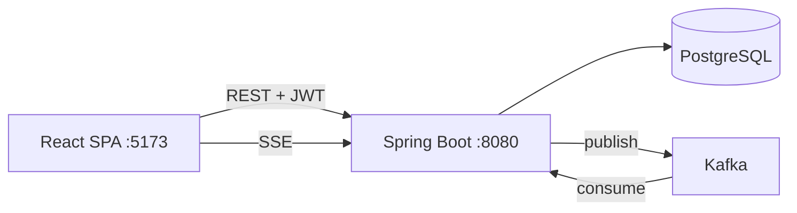
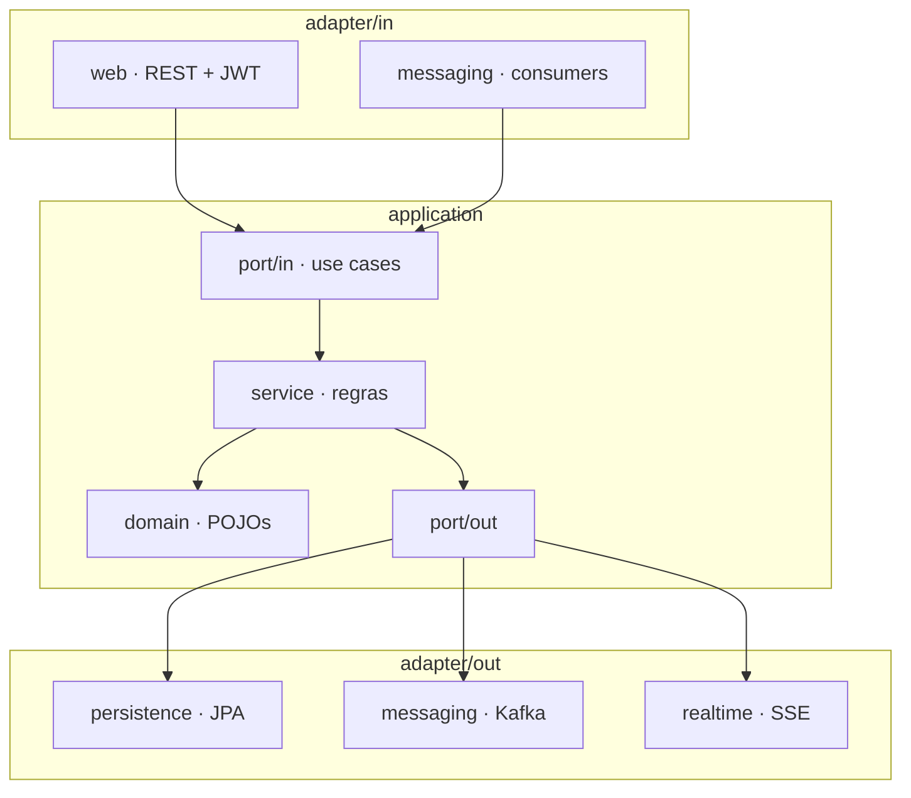
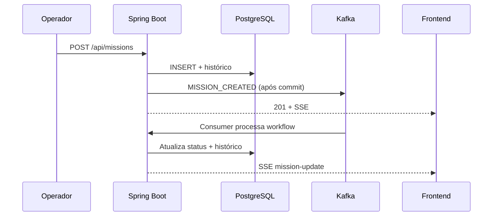

<div align="center">

# Central-LJ

### Central de Missões da Liga da Justiça

Plataforma web para **registrar, priorizar e acompanhar missões** com ciclo de vida assíncrono, histórico auditável e papéis distintos para coordenação e herói em campo.

[](https://openjdk.org/)
[](https://spring.io/projects/spring-boot)
[](https://react.dev/)
[](https://kafka.apache.org/)
[](https://www.postgresql.org/)

[Começar](#-início-rápido) ·
[Login demo](#-contas-de-demonstração) ·
[Arquitetura](#-arquitetura) ·
[Documentação](#-documentação)

</div>

---

## Sobre o projeto

A **Central-LJ** simula uma central de operações heroicas: coordenadores registram ocorrências, o sistema processa o ciclo de vida via **Kafka**, e heróis acompanham apenas o que foi designado a eles.

> Não é um CRUD genérico — cada missão é um **processo com estado**, com trilha de auditoria e processamento assíncrono após o commit da API.

| Conceito | Descrição |
|----------|-----------|
| **Missão** | Ocorrência com prioridade, local, tipo de ameaça e status |
| **Workflow** | `RECEBIDA` → … → `CONCLUIDA` (automático via consumer) |
| **Histórico** | Timeline imutável (`API_REGISTRO`, `API_ATRIBUICAO`, `KAFKA_WORKFLOW`) |
| **Papéis** | `ADMIN` / `OPERATOR` (coordenação) · `HERO` (campo) |

Visão completa do produto e dos fluxos: **[docs/visao-do-sistema.md](docs/visao-do-sistema.md)**

---

## Início rápido

### Pré-requisitos

| Ferramenta | Versão |
|------------|--------|
| Docker Desktop | Postgres + Kafka no Compose |
| JDK | 17+ |
| Node.js | 18+ |

### Subir o ambiente (3 passos)

**1 · Infraestrutura**

```bash
cd infra && docker compose up -d
```

| Serviço | URL / porta |
|---------|-------------|
| PostgreSQL | `localhost:5433` — DB `central_lj` / `central_lj` |
| Kafka | `localhost:9092` |
| Kafka UI | http://localhost:8088 |

<details>
<summary>Windows — script PowerShell</summary>

```powershell
.\infra\scripts\up.ps1
```

</details>

**2 · Backend**

```bash
cd backend && ./mvnw spring-boot:run
```

Aguarde `Started CentralLjApplication` → **http://localhost:8080**

<details>
<summary>Windows</summary>

```powershell
cd backend
.\mvnw.cmd spring-boot:run
```

</details>

**3 · Frontend**

```bash
cd frontend && npm install && npm run dev
```

→ **http://localhost:5173**

> **Dica:** se a porta **8080** já estiver em uso, o backend anterior ainda está ativo — use http://localhost:8080 ou libere a porta (`lsof -ti :8080 | xargs kill` no macOS/Linux).

---

## Contas de demonstração

Criadas automaticamente na primeira subida (`central-lj.auth.demo-seed=true`):

| Papel | E-mail | Senha | Destino após login |
|-------|--------|-------|-------------------|
| Coordenação | `coordenacao@central-lj.demo` | `Admin@demo2026` | Painel administrativo |
| Herói | `heroi.demo@central-lj.demo` | `Hero@demo2026` | `/heroi/area` |

---

## Arquitetura

### Visão geral



### Backend hexagonal



| Pacote | Responsabilidade |
|--------|------------------|
| `domain/` | Domínio puro, sem JPA |
| `application/port/in` | Contratos dos casos de uso |
| `application/port/out` | Persistência, eventos, notificações |
| `application/service` | Implementação das regras |
| `adapter/in/web` | Controllers, DTOs, segurança |
| `adapter/in/messaging` | Consumers Kafka |
| `adapter/out/persistence` | Entidades JPA e adapters |
| `adapter/out/messaging` | Produtor Kafka |
| `adapter/out/realtime` | Server-Sent Events |

---

## Stack técnica

| Camada | Tecnologias |
|--------|-------------|
| **Frontend** | React 19, Vite, TypeScript, React Router |
| **Backend** | Spring Boot 3.4, Java 17+, Flyway, Spring Security JWT |
| **Dados** | PostgreSQL 16 |
| **Mensageria** | Apache Kafka (`missions.created`) |
| **Tempo real** | SSE em `/api/missions/stream` |
| **Infra** | Docker Compose |

---

## Fluxo de uma missão



---

## Estrutura do repositório

```
central-lj/
├── backend/              # API Spring Boot (hexagonal)
├── frontend/             # SPA React + Vite
├── infra/                # Docker Compose
├── docs/
│   ├── visao-do-sistema.md
│   ├── n2/               # fluxo, auth, UI, banca
│   ├── arquitetura/      # C4, domínio
│   └── entrega/          # demo e checklists
└── assets/
```

---

## API · endpoints principais

<details>
<summary><strong>Autenticação</strong></summary>

| Método | Caminho | Descrição |
|--------|---------|-----------|
| `POST` | `/api/auth/login` | Login → JWT |
| `GET` | `/api/auth/me` | Usuário autenticado |
| `GET` | `/api/me/missions` | Missões do herói logado |

</details>

<details>
<summary><strong>Missões</strong></summary>

| Método | Caminho | Descrição |
|--------|---------|-----------|
| `POST` | `/api/missions` | Cria missão + evento Kafka |
| `GET` | `/api/missions/dashboard/summary` | Métricas do painel |
| `GET` | `/api/missions/stream` | SSE `mission-update` |
| `GET` | `/api/missions/{id}` | Detalhe + timeline |
| `PATCH` | `/api/missions/{id}/assign-hero` | Designa herói |
| `PATCH` | `/api/missions/{id}/assign-team` | Designa equipe |

</details>

<details>
<summary><strong>Elenco</strong></summary>

| Método | Caminho | Descrição |
|--------|---------|-----------|
| `POST` / `GET` | `/api/heroes` | Heróis |
| `POST` / `GET` | `/api/teams` | Equipes heroicas |

</details>

Rotas administrativas: `ADMIN` ou `OPERATOR`. Herói: somente missões **atribuídas a ele**.

---

## Kafka

| Tópico | Uso |
|--------|-----|
| **`missions.created`** | Workflow automático após criar missão |
| `missions.events` | Teste / observabilidade (N1) |

---

## Testes

```bash
cd backend && ./mvnw test
```

Relatório de cobertura (JaCoCo): `backend/target/site/jacoco/index.html`

---

## Parar o ambiente

```bash
cd infra && docker compose down   # Postgres + Kafka
# Backend e frontend: Ctrl+C
```

---

## Documentação

| Documento | Para quê |
|-----------|----------|
| [**visao-do-sistema.md**](docs/visao-do-sistema.md) | Intuito, papéis, fluxos |
| [**01-fluxo-funcional.md**](docs/n2/01-fluxo-funcional.md) | Sequência técnica |
| [**09-autenticacao-e-papeis.md**](docs/n2/09-autenticacao-e-papeis.md) | JWT e seed demo |
| [**roteiro-demo-final.md**](docs/entrega/roteiro-demo-final.md) | Apresentação / banca |
| [backend/README.md](backend/README.md) | Config do backend |
| [frontend/README.md](frontend/README.md) | Proxy Vite e build |

---

<div align="center">

**Central-LJ** — projeto acadêmico (N1 + N2)

Tema Liga da Justiça como metáfora para centrais de comando orientadas a eventos

</div>
