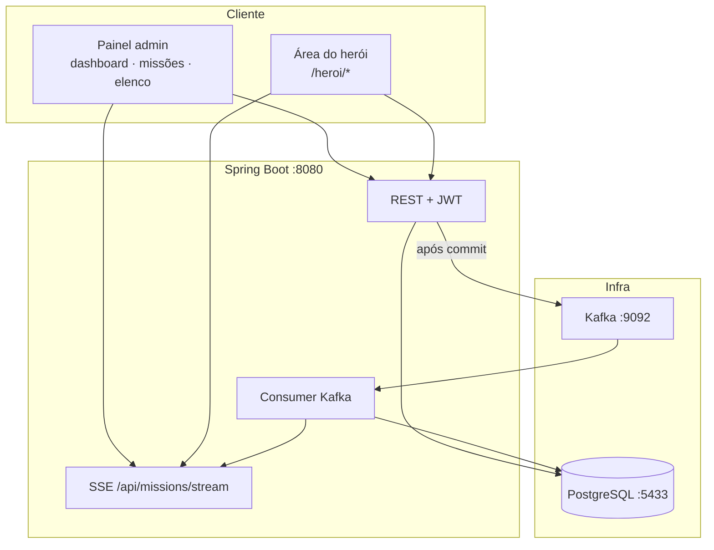
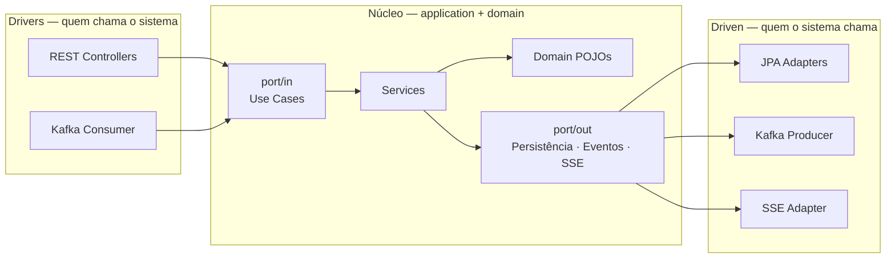
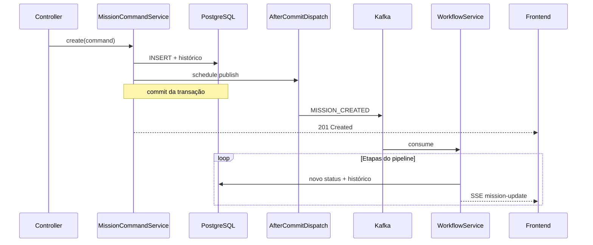

<div align="center">

# Central-LJ

### Central de Missões da Liga da Justiça

Plataforma web para **registrar, priorizar e acompanhar missões** com ciclo de vida assíncrono, histórico auditável e papéis distintos para coordenação e herói em campo.

[](https://openjdk.org/)
[](https://spring.io/projects/spring-boot)
[](https://react.dev/)
[](https://kafka.apache.org/)
[](https://www.postgresql.org/)
[](docs/visao-do-sistema.md)

</div>

<br>

**Navegação:** [Sobre](#sobre) · [Arquitetura](#arquitetura) · [Início rápido](#início-rápido) · [Login demo](#contas-de-demonstração) · [API](#api) · [Docs](#documentação)

---

## Sobre

A **Central-LJ** simula uma central de operações heroicas (projeto acadêmico N1 + N2). O foco não é um CRUD de cadastros, e sim **processos com estado**: cada missão nasce, evolui por etapas, deixa rastro no histórico e é processada em background sem bloquear a API.

| Conceito | O que significa |
|----------|-----------------|
| **Missão** | Ocorrência com prioridade, local, tipo de ameaça e status |
| **Workflow** | Pipeline automático via Kafka após a criação |
| **Histórico** | Timeline imutável de cada transição |
| **Papéis** | `ADMIN` / `OPERATOR` (coordenação) · `HERO` (campo) |

Documentação narrativa completa: **[docs/visao-do-sistema.md](docs/visao-do-sistema.md)**

---

## Arquitetura

O sistema combina três ideias: **interface dupla** (coordenação vs. campo), **backend hexagonal** (núcleo isolado de frameworks) e **processamento orientado a eventos** (Kafka + SSE).

### Visão de sistema



| Camada | Papel |
|--------|-------|
| **React (Vite)** | SPA com rotas e layouts separados por papel; consome REST e escuta SSE |
| **Spring Boot** | Orquestra regras, persiste estado, publica eventos e notifica a UI |
| **PostgreSQL** | Fonte da verdade: missões, heróis, equipes, usuários, histórico |
| **Kafka** | Desacopla “aceitar a missão na API” de “avançar o workflow” |
| **SSE** | Push de `mission-update` para o dashboard sem WebSocket |

### Backend hexagonal (ports & adapters)

O núcleo da aplicação **não depende** de Spring Web, JPA nem Kafka. Frameworks ficam nos **adapters**, que implementam **portas** definidas em `application/port/`.



**Regra de dependência:** `domain` → nada externo · `application` → só `domain` · `adapter/*` → `application` + tecnologias.

#### Pacotes do backend

```
br.edu.central.centrallj/
├── domain/                    # Missão, Herói, enums — sem anotações JPA
├── application/
│   ├── port/in/               # Contratos de entrada (use cases)
│   ├── port/out/              # Contratos de saída (DB, Kafka, notificação)
│   ├── service/               # Implementação das regras
│   ├── model/                 # Commands e views (sem JSON da API)
│   └── event/                 # Payloads de domínio para mensageria
└── adapter/
    ├── in/web/                # Controllers, DTOs, JWT, policies
    ├── in/messaging/          # Consumers e ingestão de eventos
    └── out/
        ├── persistence/       # *Entity, repositories, mappers JPA
        ├── messaging/         # Publicação no tópico missions.created
        └── realtime/          # Server-Sent Events
```

#### Portas de entrada (`port/in`)

| Use case | Responsabilidade |
|----------|------------------|
| `AuthenticateUseCase` | Login e usuário autenticado |
| `CreateMissionUseCase` | Registrar missão e disparar pipeline |
| `GetMissionUseCase` | Consultas, dashboard, timeline |
| `AssignMissionUseCase` | Designar herói ou equipe |
| `ManageHeroiUseCase` / `ManageEquipeUseCase` | Elenco heroico |
| `ProcessMissionCreatedUseCase` | Workflow consumido do Kafka |

#### Portas de saída (`port/out`)

| Porta | Implementação típica |
|-------|----------------------|
| `MissionPersistencePort` | Adapter JPA + `MissionEntity` |
| `MissionHistoryPersistencePort` | Histórico auditável |
| `MissionEventPublishPort` | Produtor Kafka |
| `MissionNotificationPort` | SSE para o frontend |
| `HeroiPersistencePort` / `EquipePersistencePort` / `UsuarioPersistencePort` | Cadastros e auth |

O domínio usa classes como `Mission` e `Heroi`; a persistência usa `MissionEntity`, `HeroiEntity`, convertidos por `PersistenceEntityMapper` — assim o **modelo de negócio não vira entidade JPA**.

#### Fluxo crítico: criar missão

1. **Adapter in (web):** `POST /api/missions` → DTO vira `CreateMissionCommand`.
2. **Service:** valida, persiste missão em `RECEBIDA`, grava histórico (`API_REGISTRO`).
3. **After commit:** só depois do commit da transação, `AfterCommitMissionDispatch` publica em `missions.created` (evita evento órfão se o INSERT falhar).
4. **Consumer:** chama `ProcessMissionCreatedUseCase`, que escolhe a **strategy** pelo nível de prioridade.
5. **Cada passo:** atualiza status, grava histórico (`KAFKA_WORKFLOW`), notifica via SSE.



#### Ciclo de vida da missão

| Prioridade | Sequência de status |
|------------|---------------------|
| **Padrão** | `RECEBIDA` → `EM_ANALISE` → `PRIORIZADA` → `EQUIPE_DESIGNADA` → `EM_ANDAMENTO` → `CONCLUIDA` |
| **CRÍTICA** | Pula `EM_ANALISE` e segue direto para `PRIORIZADA` |
| **Falha** | `FALHA_PROCESSAMENTO` se o pipeline quebrar |

> **Importante:** o herói **acompanha** missões designadas; no MVP ele **não** avança status manualmente. Atribuição (`assign-hero` / `assign-team`) é feita pelo operador, grava histórico `API_ATRIBUICAO`, mas **não** reinicia o workflow Kafka.

#### Frontend (duas experiências)

| Área | Rotas | Quem usa |
|------|-------|----------|
| **Coordenação** | `/`, `/missoes`, `/herois`, `/equipes`… | `ADMIN` / `OPERATOR` |
| **Campo** | `/heroi/area`, `/heroi/missoes`… | `HERO` |

- **`AuthContext`** — token JWT, papel e redirecionamento pós-login.
- **`AppLayout` / `HeroLayout`** — shells visuais distintos.
- **`useMissionUpdates`** — SSE + polling (~12s) para manter listas atualizadas.
- **`services/api.ts`** — cliente HTTP centralizado; proxy Vite encaminha `/api` para `:8080`.

#### Decisões de desenho (resumo)

| Decisão | Motivo |
|---------|--------|
| Hexagonal no backend | Testar regras sem subir servlet/Kafka; trocar adapter sem reescrever domínio |
| Kafka após commit | Consistência: mensagem só existe se o registro foi persistido |
| Strategy por prioridade | Regras diferentes (crítica vs. padrão) sem `if` espalhado no consumer |
| SSE em vez de WebSocket | Atualização unidirecional simples para o dashboard |
| Histórico imutável | Auditoria e timeline na UI para banca/demo |

Diagramas C4 e domínio: [docs/arquitetura/](docs/arquitetura/) · fluxo passo a passo: [docs/n2/01-fluxo-funcional.md](docs/n2/01-fluxo-funcional.md)

---

## Stack

| Camada | Tecnologias |
|--------|-------------|
| Frontend | React 19, Vite, TypeScript, React Router |
| Backend | Spring Boot 3.4, Java 17+, Flyway, Spring Security (JWT) |
| Dados | PostgreSQL 16 |
| Mensageria | Apache Kafka — tópico `missions.created` |
| Tempo real | SSE — `/api/missions/stream` |
| Infra local | Docker Compose (`infra/`) |

---

## Início rápido

### Pré-requisitos

| Ferramenta | Versão |
|------------|--------|
| Docker Desktop | Postgres + Kafka |
| JDK | 17+ |
| Node.js | 18+ |

### 1 · Infraestrutura

```bash
cd infra && docker compose up -d
```

| Serviço | Endereço |
|---------|----------|
| PostgreSQL | `localhost:5433` — DB/user/pass: `central_lj` |
| Kafka | `localhost:9092` |
| Kafka UI | http://localhost:8088 |

<details>
<summary>Windows — PowerShell</summary>

```powershell
.\infra\scripts\up.ps1
```

</details>

### 2 · Backend

```bash
cd backend && ./mvnw spring-boot:run
```

Aguarde `Started CentralLjApplication` → http://localhost:8080

<details>
<summary>Windows</summary>

```powershell
cd backend
.\mvnw.cmd spring-boot:run
```

</details>

### 3 · Frontend

```bash
cd frontend && npm install && npm run dev
```

→ http://localhost:5173

> Porta **8080** ocupada? O backend anterior ainda está rodando — use-o ou encerre: `lsof -ti :8080 | xargs kill` (macOS/Linux).

---

## Contas de demonstração

Seed automático na primeira subida (`central-lj.auth.demo-seed=true`):

| Papel | E-mail | Senha | Após login |
|-------|--------|-------|------------|
| Coordenação | `coordenacao@central-lj.demo` | `Admin@demo2026` | Painel admin |
| Herói | `heroi.demo@central-lj.demo` | `Hero@demo2026` | `/heroi/area` |

---

## Estrutura do repositório

```
central-lj/
├── backend/     # API hexagonal (domain · application · adapter)
├── frontend/    # SPA React — admin + área do herói
├── infra/       # docker-compose.yml (Postgres, Kafka, Kafka UI)
├── docs/        # visão do sistema, N1/N2, arquitetura, entrega
└── assets/      # imagens e recursos estáticos
```

---

## API

<details>
<summary><strong>Autenticação</strong></summary>

| Método | Caminho | Descrição |
|--------|---------|-----------|
| `POST` | `/api/auth/login` | Login → JWT |
| `GET` | `/api/auth/me` | Usuário autenticado |
| `GET` | `/api/me/missions` | Missões do herói logado |

</details>

<details>
<summary><strong>Missões</strong></summary>

| Método | Caminho | Descrição |
|--------|---------|-----------|
| `POST` | `/api/missions` | Cria missão + evento Kafka |
| `GET` | `/api/missions/dashboard/summary` | Métricas do painel |
| `GET` | `/api/missions/stream` | SSE `mission-update` |
| `GET` | `/api/missions/{id}` | Detalhe + timeline |
| `PATCH` | `/api/missions/{id}/assign-hero` | Designa herói |
| `PATCH` | `/api/missions/{id}/assign-team` | Designa equipe |

</details>

<details>
<summary><strong>Elenco</strong></summary>

| Método | Caminho | Descrição |
|--------|---------|-----------|
| `POST` / `GET` | `/api/heroes` | Heróis |
| `POST` / `GET` | `/api/teams` | Equipes heroicas |

</details>

Rotas administrativas exigem `ADMIN` ou `OPERATOR`. Herói acessa apenas missões **atribuídas a ele** (`MissionViewPolicy`, `HeroiAccessPolicy`).

---

## Kafka

| Tópico | Uso |
|--------|-----|
| **`missions.created`** | Workflow automático após criar missão |
| `missions.events` | Teste / observabilidade (legado N1) |

---

## Testes

```bash
cd backend && ./mvnw test
```

Cobertura JaCoCo: `backend/target/site/jacoco/index.html`

---

## Parar o ambiente

```bash
cd infra && docker compose down
# Backend e frontend: Ctrl+C nos terminais
```

---

## Documentação

| Documento | Conteúdo |
|-----------|----------|
| [**visao-do-sistema.md**](docs/visao-do-sistema.md) | Visão de produto, fluxos, papéis |
| [**01-fluxo-funcional.md**](docs/n2/01-fluxo-funcional.md) | Sequência técnica detalhada |
| [**09-autenticacao-e-papeis.md**](docs/n2/09-autenticacao-e-papeis.md) | JWT, roles, seed |
| [**08-atribuicao-de-missoes.md**](docs/n2/08-atribuicao-de-missoes.md) | Assign hero/team |
| [**roteiro-demo-final.md**](docs/entrega/roteiro-demo-final.md) | Roteiro de apresentação |
| [backend/README.md](backend/README.md) | Config e pacotes do backend |
| [frontend/README.md](frontend/README.md) | Proxy Vite e build |

---

<div align="center">

**Central-LJ** — arquitetura distribuída com tema Liga da Justiça

Projeto acadêmico · N1 (eventos) + N2 (auth, herói, atribuição, hexagonal)

</div>
