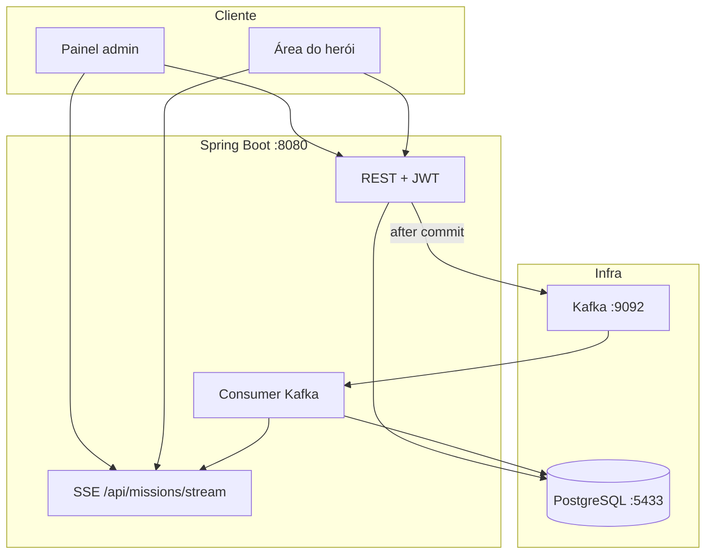

<div align="center">

# Central-LJ

### Central de Missões da Liga da Justiça

Plataforma web para **registrar, priorizar e acompanhar missões** com ciclo de vida assíncrono, histórico auditável e papéis distintos — coordenação e herói em campo.

<br>

[](https://openjdk.org/)
[](https://spring.io/projects/spring-boot)
[](https://react.dev/)
[](https://kafka.apache.org/)
[](https://www.postgresql.org/)
[](docs/visao-do-sistema.md)

<br>

[📖 Sobre](#-sobre) ·
[✨ Funcionalidades](#-funcionalidades) ·
[🏗️ Arquitetura](#️-arquitetura) ·
[🛠️ Stack](#️-stack) ·
[🚀 Início rápido](#-início-rápido) ·
[🔐 Demo](#-contas-de-demonstração) ·
[📁 Estrutura](#-estrutura-do-repositório) ·
[🔌 API](#-api) ·
[📚 Docs](#-documentação)

<br>

---

</div>

<div align="center">

## 📖 Sobre

A **Central-LJ** simula uma central de operações heroicas — projeto acadêmico **N1 + N2**.

O foco não é um CRUD de cadastros, e sim **processos com estado**: missões nascem, evoluem por etapas, deixam rastro no histórico e são processadas em background sem bloquear a API.

| Conceito | O que significa |
|:--------:|:----------------|
| **Missão** | Ocorrência com prioridade, local, tipo de ameaça e status |
| **Workflow** | Pipeline automático via Kafka após a criação (N1) |
| **Histórico** | Timeline imutável de cada transição |
| **Papéis** | `ADMIN` / `OPERATOR` (coordenação) · `HERO` (campo) |
| **Atribuição** | Operador designa herói ou equipe — grava histórico (N2) |

<br>

📄 Documentação narrativa completa → **[docs/visao-do-sistema.md](docs/visao-do-sistema.md)**

<br>

---

## ✨ Funcionalidades

| Módulo | Destaques |
|:------:|:----------|
| **N1 — Eventos** | Criação de missão · Kafka `missions.created` · workflow automático · SSE no dashboard |
| **N2 — Operações** | JWT e papéis · painel admin vs. área do herói · atribuição herói/equipe · timeline auditável |

<br>

---

## 🏗️ Arquitetura

Três pilares: **interface dupla** (coordenação vs. campo), **backend hexagonal** e **processamento orientado a eventos** (Kafka + SSE).

</div>

<div align="center">



</div>

<div align="center">

| Camada | Papel |
|:------:|:------|
| **React (Vite)** | SPA com rotas e layouts separados por papel; REST e SSE |
| **Spring Boot** | Regras de negócio, persistência, Kafka, notificações |
| **PostgreSQL** | Fonte da verdade — missões, heróis, equipes, usuários, histórico |
| **Kafka** | Desacopla aceite na API do avanço do workflow |
| **SSE** | Push `mission-update` para o dashboard |

<br>

### Backend hexagonal

O núcleo **não depende** de Spring Web, JPA nem Kafka. Frameworks ficam nos **adapters**; o domínio fica em `domain/` e `application/`.

```
domain/ → application/ (port/in · service · port/out) → adapter/in · adapter/out
```

| Porta de entrada | Responsabilidade |
|:----------------:|:-----------------|
| `CreateMissionUseCase` | Registrar missão e disparar pipeline |
| `GetMissionUseCase` | Consultas, dashboard, timeline |
| `AssignMissionUseCase` | Designar herói ou equipe |
| `AuthenticateUseCase` | Login e usuário autenticado |
| `ProcessMissionCreatedUseCase` | Workflow consumido do Kafka |

<br>

📐 Diagramas C4 e classes → **[docs/arquitetura/](docs/arquitetura/)**  
🔄 Fluxo funcional N2 → **[docs/n2/01-fluxo-funcional.md](docs/n2/01-fluxo-funcional.md)**  
📄 Documentação técnica (PDF) → **[docs/documentacao-tecnica-central-lj.pdf](docs/documentacao-tecnica-central-lj.pdf)**

<br>

---

## 🛠️ Stack

| Camada | Tecnologias |
|:------:|:------------|
| **Frontend** | React 19 · Vite · TypeScript · React Router |
| **Backend** | Spring Boot 3.4 · Java 17+ · Flyway · Spring Security (JWT) |
| **Dados** | PostgreSQL 16 |
| **Mensageria** | Apache Kafka — `missions.created` |
| **Tempo real** | SSE — `/api/missions/stream` |
| **Infra local** | Docker Compose em `infra/` |

<br>

---

## 🚀 Início rápido

### Pré-requisitos

| Ferramenta | Versão |
|:----------:|:------:|
| Docker Desktop | Postgres + Kafka |
| JDK | 17+ |
| Node.js | 18+ |

<br>

### 1 · Infraestrutura

</div>

```bash
cd infra && docker compose up -d
```

<div align="center">

| Serviço | Endereço |
|:-------:|:---------|
| PostgreSQL | `localhost:5433` — DB/user/pass: `central_lj` |
| Kafka | `localhost:9092` |
| Kafka UI | http://localhost:8088 |

<details>
<summary><strong>Windows — PowerShell</strong></summary>

```powershell
.\infra\scripts\up.ps1
```

</details>

<br>

### 2 · Backend

</div>

```bash
cd backend && ./mvnw spring-boot:run
```

<div align="center">

Aguarde `Started CentralLjApplication` → http://localhost:8080

<details>
<summary><strong>Windows</strong></summary>

```powershell
cd backend
.\mvnw.cmd spring-boot:run
```

</details>

<br>

### 3 · Frontend

</div>

```bash
cd frontend && npm install && npm run dev
```

<div align="center">

→ http://localhost:5173

<br>

> Porta **8080** ocupada? Encerre o processo anterior ou reutilize a instância em execução.

<br>

---

## 🚢 Produção com Docker Compose

</div>

O deploy de produção publica somente o frontend Nginx. Ele serve a SPA e encaminha `/api` para o backend no mesmo domínio; PostgreSQL, Kafka e backend permanecem na rede interna do Compose.

Para publicação gratuita com serviços gerenciados, consulte
**[docs/deploy-cloud-free.md](docs/deploy-cloud-free.md)**.

```bash
cp infra/.env.prod.example infra/.env.prod
# Edite infra/.env.prod e substitua as senhas de exemplo.
docker compose --env-file infra/.env.prod -f infra/docker-compose.prod.yml up -d --build
```

Abra o endereço configurado em `HTTP_BIND`. Para conferir a API:

```bash
curl http://localhost/api/health
docker compose --env-file infra/.env.prod -f infra/docker-compose.prod.yml ps
```

Em uma publicação acessível pela internet, coloque um proxy HTTPS na frente da porta HTTP e use `HTTP_BIND=127.0.0.1:8080`. O seed com contas conhecidas fica desabilitado por padrão. Para publicar a versão demonstrativa com o painel de coordenação, defina `CENTRAL_LJ_AUTH_DEMO_SEED=true` antes da primeira subida e não reutilize essa configuração para dados reais.

Para atualizar uma instalação:

```bash
git pull
docker compose --env-file infra/.env.prod -f infra/docker-compose.prod.yml up -d --build
```

<div align="center">

---

## 🔐 Contas de demonstração

Seed automático na primeira subida (`central-lj.auth.demo-seed=true`):

| Papel | E-mail | Senha | Destino após login |
|:-----:|:------:|:-----:|:-------------------|
| Coordenação | `coordenacao@central-lj.demo` | `Admin@demo2026` | Painel admin |
| Herói | `heroi.demo@central-lj.demo` | `Hero@demo2026` | `/heroi/area` |

<br>

---

## 📁 Estrutura do repositório

```
central-lj/
├── backend/     # API hexagonal (domain · application · adapter)
├── frontend/    # SPA React — admin + área do herói
├── infra/       # docker-compose (Postgres, Kafka, Kafka UI)
├── docs/        # visão, N1/N2, arquitetura, entrega
└── assets/      # imagens e recursos estáticos
```

<br>

---

## 🔌 API

<details>
<summary><strong>Autenticação</strong></summary>

| Método | Caminho | Descrição |
|:------:|:--------|:----------|
| `POST` | `/api/auth/login` | Login → JWT |
| `GET` | `/api/auth/me` | Usuário autenticado |
| `GET` | `/api/me/missions` | Missões do herói logado |

</details>

<details>
<summary><strong>Missões (coordenação)</strong></summary>

| Método | Caminho | Descrição |
|:------:|:--------|:----------|
| `POST` | `/api/missions` | Cria missão + evento Kafka |
| `GET` | `/api/missions/dashboard/summary` | Métricas do painel |
| `GET` | `/api/missions/stream` | SSE `mission-update` |
| `GET` | `/api/missions/{id}` | Detalhe + timeline |
| `PATCH` | `/api/missions/{id}/assign-hero` | Designa herói |
| `PATCH` | `/api/missions/{id}/assign-team` | Designa equipe |

</details>

<details>
<summary><strong>Elenco</strong></summary>

| Método | Caminho | Descrição |
|:------:|:--------|:----------|
| `POST` / `GET` | `/api/heroes` | Heróis |
| `POST` / `GET` | `/api/teams` | Equipes heroicas |

</details>

<br>

Rotas administrativas exigem `ADMIN` ou `OPERATOR`. Herói acessa apenas missões **atribuídas a ele**.

<br>

---

## 🧪 Testes

</div>

```bash
cd backend && ./mvnw test
```

<div align="center">

Relatório JaCoCo → `backend/target/site/jacoco/index.html`

<br>

---

## 🛑 Parar o ambiente

</div>

```bash
cd infra && docker compose down
```

<div align="center">

Backend e frontend: `Ctrl+C` nos terminais respectivos.

<br>

---

## 📚 Documentação

| Documento | Conteúdo |
|:---------:|:---------|
| [**documentacao-tecnica-central-lj.pdf**](docs/documentacao-tecnica-central-lj.pdf) | Documentação técnica formal (Typst) — arquitetura, diagramas, Kafka, testes |
| [**visao-do-sistema.md**](docs/visao-do-sistema.md) | Visão de produto, fluxos e papéis |
| [**01-fluxo-funcional.md**](docs/n2/01-fluxo-funcional.md) | Sequência técnica N2 |
| [**n3-implementacao-missoes-pvp-puzzles.md**](docs/n3-implementacao-missoes-pvp-puzzles.md) | Plano futuro (fora do escopo de entrega) |
| [**09-autenticacao-e-papeis.md**](docs/n2/09-autenticacao-e-papeis.md) | JWT, roles e seed |
| [**roteiro-demo-final.md**](docs/entrega/roteiro-demo-final.md) | Roteiro de apresentação |
| [backend/README.md](backend/README.md) | Config e pacotes do backend |
| [frontend/README.md](frontend/README.md) | Proxy Vite e build |

<br>

---

<br>

**Central-LJ** — arquitetura distribuída com tema Liga da Justiça

*Projeto acadêmico · N1 (eventos) · N2 (auth, herói, atribuição, hexagonal)*

<br>

</div>
