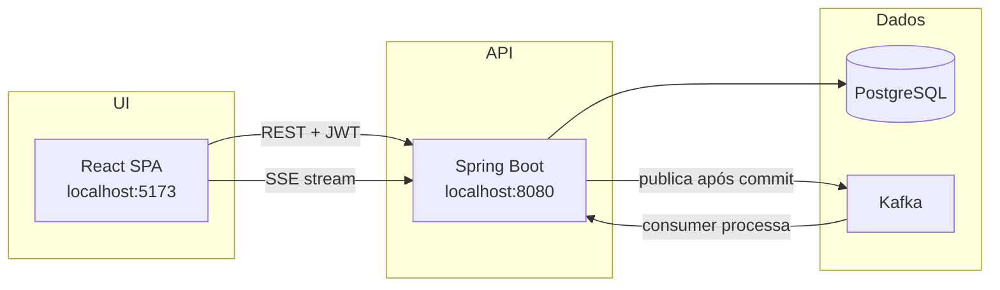
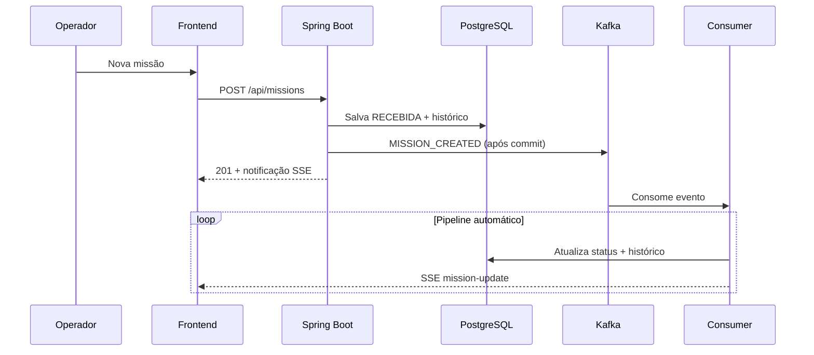

# Central-LJ — Visão do Sistema

**Central de Missões da Liga da Justiça** é uma plataforma acadêmica que simula uma **central de operações**: coordenadores registram ocorrências (“missões”), o sistema **processa o ciclo de vida de forma assíncrona** via Kafka, e heróis acompanham o que foi designado a eles. O tema é didático; o desenho técnico imita centrais de comando reais.

---

## Intuito do sistema

O problema que ele resolve não é “cadastrar registros”, e sim **gerenciar processos com estado**:

- Missões chegam com prioridade, local e tipo de ameaça
- O status **evolui ao longo do tempo** (recebida → análise → execução → conclusão)
- Tudo fica **auditável** em uma linha do tempo
- O processamento pesado **não trava a API** — vai para o Kafka

É um exercício de **arquitetura distribuída**: React + Spring Boot + PostgreSQL + Kafka + atualizações em tempo quase real (SSE).

---

## Arquitetura em camadas

| Componente | Função |
|------------|--------|
| **Frontend** | Duas interfaces: coordenação (admin) e campo (herói) |
| **Backend** | API REST, autenticação JWT, regras de negócio, produtor/consumidor Kafka |
| **PostgreSQL** | Estado autoritativo: missões, heróis, equipes, histórico |
| **Kafka** | Backbone de eventos — desacopla “aceitar a missão” de “processá-la” |
| **SSE** | Push de atualizações para o dashboard sem WebSocket |

---

## Entidades principais

- **Missão** — ocorrência com título, ameaça, prioridade, local, status e responsável (herói ou equipe)
- **Herói** — operador de campo com especialidade e disponibilidade (`DISPONIVEL`, `EM_MISSAO`, `INATIVO`)
- **Equipe heroica** — agrupamento de heróis
- **Histórico da missão** — trilha imutável de cada mudança de status (quem/o quê/quando)
- **Usuário** — conta de login com papel (`ADMIN`, `HERO`, `OPERATOR`) vinculada opcionalmente a um herói

---

## Fluxo principal (criar missão → conclusão)

### Estados da missão

**Fluxo padrão:**

`RECEBIDA → EM_ANALISE → PRIORIZADA → EQUIPE_DESIGNADA → EM_ANDAMENTO → CONCLUIDA`

**Prioridade CRÍTICA:** pula `EM_ANALISE` e vai direto para `PRIORIZADA`.

**Erro no pipeline:** `FALHA_PROCESSAMENTO`.

### Ponto importante

As transições de status são **automáticas via Kafka** — o herói **não clica em “aceitar” ou “concluir”** no MVP. O herói **acompanha** missões designadas a ele. A atribuição manual (herói/equipe) é feita pelo operador e fica registrada no histórico, mas **não dispara** um novo passo do workflow Kafka.

---

## O que cada tipo de usuário faz

Existem 3 papéis (`ADMIN`, `OPERATOR`, `HERO`). Hoje `OPERATOR` se comporta como admin na UI; está reservado para evolução futura.

### Admin / Operador (coordenação)

Interface completa: dashboard, listagens, cadastros.

| Ação | O que faz |
|------|-----------|
| Ver dashboard | Métricas, missões recentes, resumo por status |
| Criar missão | Dispara todo o pipeline Kafka |
| Listar/filtrar missões | Visão global de todas as ocorrências |
| Atribuir herói ou equipe | `PATCH assign-hero` / `assign-team` |
| Cadastrar heróis e equipes | Gestão de recursos disponíveis |
| Ver detalhe + timeline | Qualquer missão |
| Atualizar disponibilidade de herói | Qualquer herói |

**Login demo:** `coordenacao@central-lj.demo` / `Admin@demo2026`

### Herói (campo)

Interface simplificada em `/heroi/*`.

| Ação | O que faz |
|------|-----------|
| Ver área do herói | Home com contexto operacional |
| Minhas missões | Só missões **atribuídas a ele** |
| Ver detalhe da missão | Apenas se for responsável |
| Ver próprio perfil | Dados do herói vinculado à conta |
| Atualizar disponibilidade | Só o **próprio** perfil |

**Não pode:** criar missões, atribuir responsáveis, ver listagem global, cadastrar heróis/equipes.

**Login demo:** `heroi.demo@central-lj.demo` / `Hero@demo2026`

---

## Fluxos secundários

### Cadastro de equipe/herói (admin)

1. Cria equipe → `/equipes/nova`
2. Cria herói (opcionalmente vinculado à equipe) → `/herois/nova`
3. Herói pode ser associado a um usuário de login com papel `HERO`

### Atribuição manual (admin)

1. Abre detalhe da missão
2. Escolhe herói **ou** equipe (exclusivo — um ou outro)
3. Sistema grava histórico com origem `API_ATRIBUICAO`
4. Se herói individual, disponibilidade vai para `EM_MISSAO`

### Acompanhamento em tempo real

- Backend envia eventos SSE em `/api/missions/stream`
- Frontend também faz polling a cada ~12s e atualiza ao focar a aba
- Kafka UI em http://localhost:8088 mostra mensagens no tópico `missions.created`

---

## Resumo mental

| Papel | Metáfora | Poder principal |
|-------|----------|-----------------|
| **Admin/Operador** | Coordenador da Torre de Vigilância | Cria, atribui, monitora tudo |
| **Herói** | Agente em campo | Só vê e acompanha **suas** missões |
| **Kafka** | Motor invisível | Avança o status automaticamente após criação |
| **Histórico** | Caixa-preta | Prova cada transição (API ou workflow) |

---

## Documentação relacionada

| Tópico | Arquivo |
|--------|---------|
| Fluxo funcional detalhado | [n2/01-fluxo-funcional.md](n2/01-fluxo-funcional.md) |
| Autenticação e papéis | [n2/09-autenticacao-e-papeis.md](n2/09-autenticacao-e-papeis.md) |
| Área do herói | [n2/10-area-do-heroi.md](n2/10-area-do-heroi.md) |
| Atribuição de missões | [n2/08-atribuicao-de-missoes.md](n2/08-atribuicao-de-missoes.md) |
| Heróis e equipes | [n2/07-modulo-herois-equipes.md](n2/07-modulo-herois-equipes.md) |
| Visão geral N1 | [n1/01-visao-geral.md](n1/01-visao-geral.md) |
